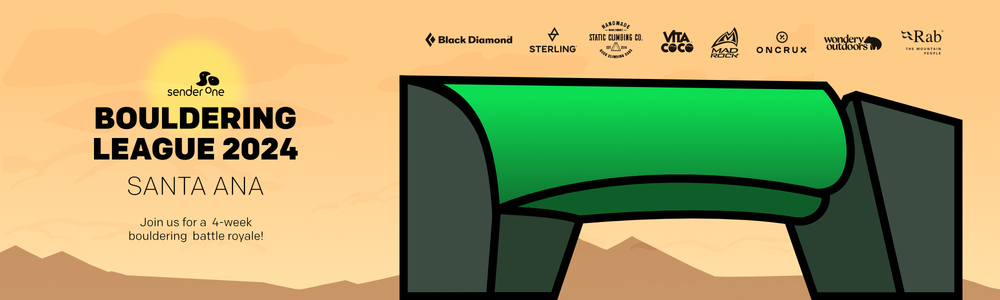
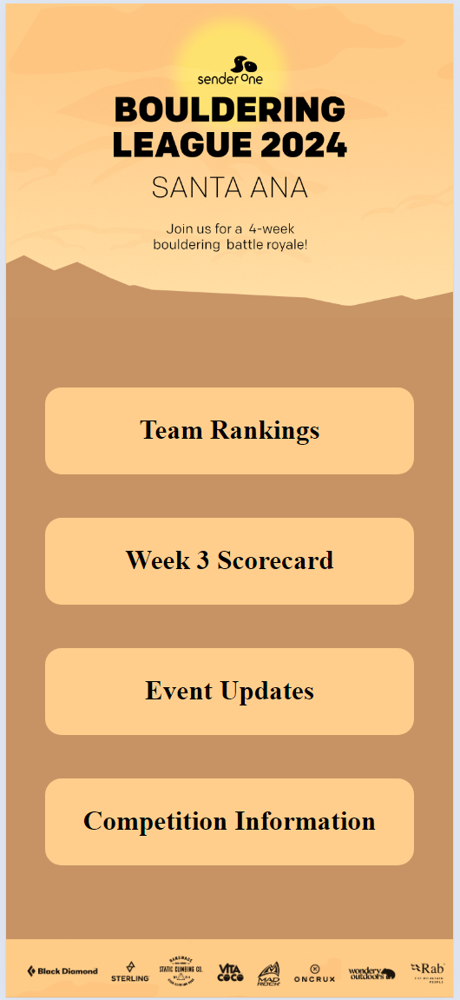

<div align="center">
<h1>Bouldering League Web App</h1>
 <p align="center">
  

<br>
<br>

<h4>PWA for managing data generated from a 4 week bouldering league. This App Enabled users to upload scorecard and review team rankings.</h4>
</div>

<br>
<br>

## Table-of-Contents

* [Goal](#description)
* [Features](#features)
* [Installation](#installation)
* [Software Stack](#software-stack)
* [Hardware Stack](#hardware-stack)
* [Wireframe](#wireframe)
<!-- * [Demo](#demo) -->


<br>

## [Goals](#table-of-contents)

To reduce the staff workload managing weekly bouldering league data while creating a higher quality user experiance to create community engagement during the 4 week event.

<br>
<br>


## [Features](#table-of-contents)

- Enable Climbers to submit weekly session scorecard
- View Team Rankings
- Each team has a team page "example.com/2024_SNA/teams/$TEAM-ID"
- Each climber has a profile page "example.com/2024_SNA/climber/$CLIMBER-ID"
- Event Rules/History
- Weekly Event Blog/Huddle/Updates/Last Week Interesting Data

<br>
<br>

## [Installation](#table-of-contents)

* Server/API
  ```
      1) npm run buildServer
      2) npm run startServer
  ```
<br>

* Client
  ```
  1) npm run buildClient
  2) npm run startClientServe
  ```
<br>
<br>


## [Software Stack](#table-of-contents)

* **Databases**
  * mySQL (relational)
    * climber
    * scorecard
    * event

<br>

* **Server** (Node 18.18.0)
  * NPM Packages
    * @apollo/server (4.10.0)
    * body-parser (1.20.2)
    * cors (2.8.5)
    * dotenv (16.3.1)
    * express (4.18.2)
    * express-rate-limit (7.1.5)
    * graphql (16.8.1)
    * graphql-http (1.22.0)
    * helmet (7.1.0)
    * mysql2 (3.7.0)
    * react (18.2.0)
    * sequelize (6.35.2)

<br>

* **Client** (React 18.2.0)
  * NPM Packages
    * @apollo/client
    * @emotion/react
    * @emotion/styled
    * bootstrap
    * jquery
    * react
    * react-bootstrap
    * react-dom
    * react-material-symbols
    * react-popper
    * react-router-dom
    * react-scripts
    * react-switch
    * reactjs-popup

<br>


## [Hardware Stack](#table-of-contents)

**Host: ThinClient Docker**
  * Client:
  * API:
  <br>

**Database: Self Host via Docker**
  * mySQL
  <br>

**Version Control: GitHub**
  * https://github.com/DesertCow/bouldering-league_v0
  <br>

<br>
<br>

## [Demo](#table-of-contents)

<div align="center">
<h2>Home Page</h2>
<div/>
 <p align="center">
  
</p>

<br>
<br>

<div align="center">  
  <h2>Team Rankings</h2>
<div/>
<p align="center">
  
</p>

<br>
<br>

<div align="center">
  <h2>Climber Profile Page</h2>
<div/>
<p align="center">
  
</p>

<br>
<br>

<div align="center">
  <h2>Team Page</h2>
<div/>
<p align="center">
  
</p>

<br>
<br>

<div align="center">
  <h2>Scorecard Submit Page</h2>
<div/>
<p align="center">
  
</p>

<br>
<br>
